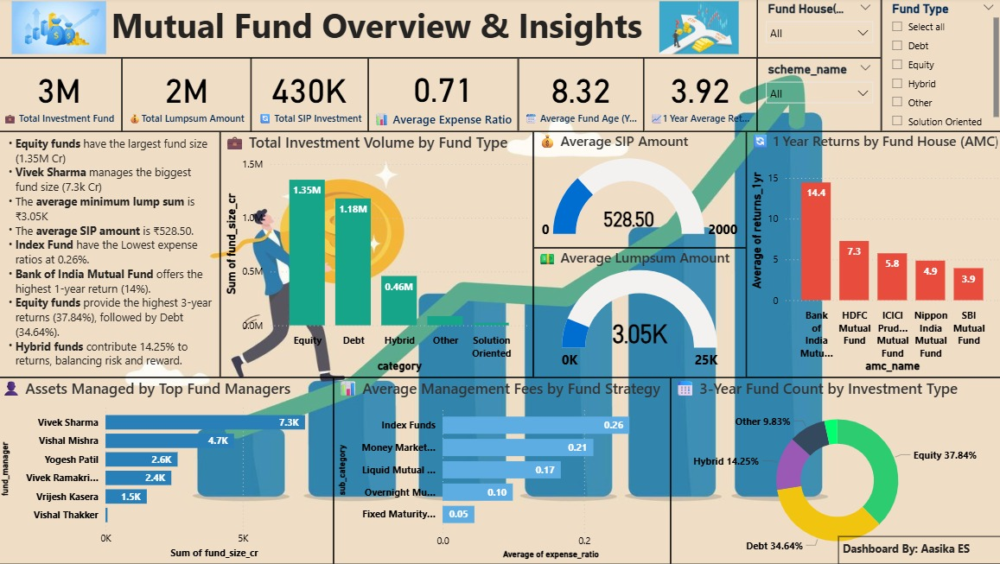

# 📊 Mutual Fund Performance Dashboard – Insights with Python & Power BI

This mutual fund analysis project identifies the top 30 schemes offering high returns with low risk using Python, Excel, and Power BI.

🛠️ **Tools Used:** Python (Pandas, Sklearn), Excel, Power BI  
📁 **Dataset:** Over 2500 Mutual Fund Schemes (Top 30 Filtered)

---

## 🧠 Project Goal

To analyze mutual fund performance and highlight top-performing, low-risk schemes through a dynamic, interactive dashboard that supports informed investment decisions.

---

## 🐍 Python-Based Analysis Workflow

I used Python to clean, preprocess, and evaluate mutual fund data from over 2500 schemes.

### 1. Data Cleaning
- Dropped redundant columns
- Handled missing values
- Standardized numerical formats (returns, expenses)

### 2. Descriptive Analysis
- Statistical summaries (mean, std, min, max)
- Fund classification by return, risk, age

### 3. Data Normalization
- Used `MinMaxScaler` to normalize numerical features

### 4. Fund Scoring Logic
Scored and ranked based on:
- High 3-Year Returns  
- Low Expense Ratio  
- Stable 1-Year Return  
- Balanced Fund Age

### 5. Final Output
Filtered the **Top 30 mutual funds** with best performance-to-risk ratio  
📎 See: `top_30_mutual_funds.xlsx`

---

## 📈 Power BI Dashboard

Used Power BI to build a professional dashboard that visualizes investment trends and KPIs across mutual fund schemes.

📁 Power BI File: `Mutual Fund Dashboard.pbix`  
🖼️ Dashboard Preview: `Mutual Fund Dashboard .png.jpg`

---

## 📌 Dashboard Features

### 🧩 Filters
- Fund Type, Risk Level, AMC Name, Category

### 📊 Visual Highlights
- **Total AUM by Fund Type**
- **Top Performing AMCs**
- **SIP vs Lumpsum Metrics**
- **Expense Ratios by Category**
- **3-Year Return Donut Chart**
- **Fund Manager AUM Distribution**
- **Insight Cards** for quick takeaways

---

## 🔍 Key Investment Insights

| Area | Insight |
|------|---------|
| 📈 Top Return (1Y) | Bank of India MF – 14.4% |
| 💼 Fund Type | Equity Funds dominate with ₹1.35M Cr AUM |
| 👥 Fund Manager | Vivek Sharma manages ₹7.3M Cr |
| 💰 Cost Efficiency | Index Funds have lowest avg. expense ratio |
| 🔄 SIP Avg | ₹528/month with ₹3,050 minimum lumpsum |

---

## 🖼️ Dashboard Preview

---

## 🧠 Final Thoughts

This project highlights how **data-driven insights** can empower better financial decisions. By combining Python for analysis, Excel for formatting, and Power BI for storytelling, the final output supports users in identifying high-return, low-risk investments with clarity.

---

## 🔧 Tool Summary

| Tool | Purpose |
|------|---------|
| Python | Data processing and scoring logic |
| Excel | Format validation and support |
| Power BI | Interactive dashboard and visual analysis |

---

## 📁 Files in This Repository

| File | Description |
|------|-------------|
| `top_30_mutual_funds.xlsx` | Final filtered mutual fund list |
| `Mutual Fund Dashboard.pbix` | Interactive dashboard |
| `Mutual Fund Dashboard .png.jpg` | Dashboard image preview |

---

## 🙋 About Me

👩‍💻 **Aashika ES**  
Final Year MSc Data Science Student  
📬 aasikasivaji@gmail.com

---

